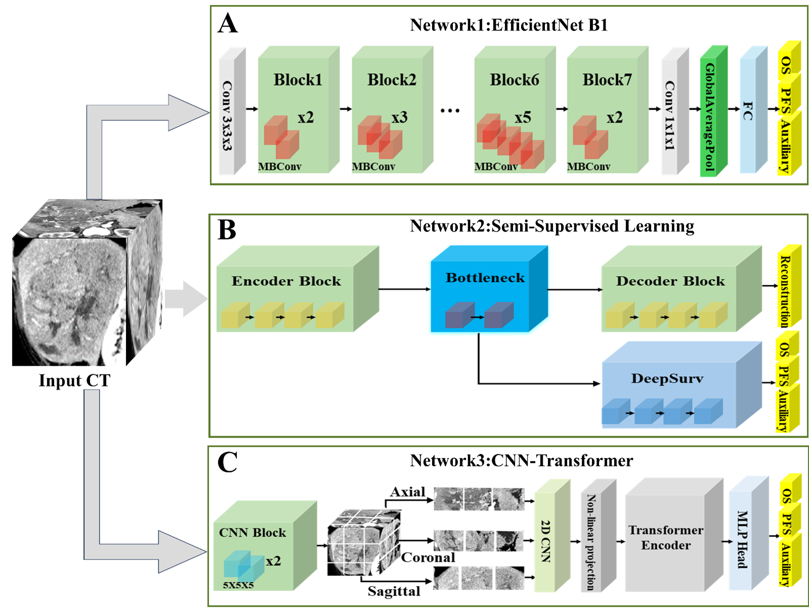

<p align="center">
  <h2 align="center"> CT-Based Ensemble Deep Learning for Predicting Survival Benefits of Immune Checkpoint Inhibitors in Unresectable Hepatocellular Carcinoma: A Multicenter Study</h2>
</p>

## Our article is in the submission stage...

[](LICENSE)

## Overview

We developed an Ensemble-DL model using pre-treatment multiphase CT images to predict overall survival (OS) and progression-free survival (PFS). Three additional machine learning models were built for comparison based on radiomic features, tumor size-based criteria, and established clinical risk factors. We assessed the Ensemble-DL signature's incremental predictive value compared to clinical risk factors and evaluated the model's interpretability.


## Table of Contents

- [Installation](#installation)
- [Dataset](#dataset)
- [Model](#model)
- [Results](#results)
- [License](#license)
- [Citation](#Citation)

## Installation

Please follow the guide to install and set up the project.

```bash
# Clone the repository
git clone https://github.com/sunzc-sunny/PPAD.git

# Create conda environment
conda env create -f environment.yml
conda activate ppad
```
## Dataset

**ZhangLab Chest X-ray**  <br>
Please download the offical ZhangLab Chest X-ray benchmark from SQUID [Google drive](https://drive.google.com/file/d/1kgYtvVvyfPnQnrPhhLt50ZK9SnxJpriC/view?usp=sharing).

**Stanford ChexPert** <br>
Please download the offical Stanford ChexPert benchmark from SQUID [Google drive](https://drive.google.com/file/d/14pEg9ch0fsice29O8HOjnyJ7Zg4GYNXM/view?usp=sharing).

**VinDr-CXR** <br>
Please download the offical Med-AD benchmark from DDAD [Google Drive](https://drive.google.com/file/d/1ijdaVBNdkYP4h0ClYFYTq9fN1eHoOSa6/view?usp=sharing).  <br>
The Med-AD benchmark is organized using four public datasets, and VinDr-CXR is one of them.

## Model


* **Network 1 (EfficientNet B1 Model):** This subnetwork uses the EfficientNet B1 convolutional neural network (CNN) for supervised learning (Figure A).<br>
* **Network 2 (Hybrid Supervised-Unsupervised Model):** This subnetwork employs a two-stage approach (Figure B).<br>
* **Network 3 (CNN-Transformer Model):** This subnetwork adopts a CNN-Transformer architecture based on multi-plane and multi-slice Transformer networks (Figure C).

## Results

### Benchmark Results on ZhangLab and CheXpert Datasets


| Method                 |                   | ZhangLab Dataset |                      |                      | CheXpert Dataset  |                      | 
|------------------------|-------------------|------------------|----------------------|----------------------|-------------------|----------------------|
|                       | ACC (\%) ↑       | AUC (\%) ↑           | F1 (\%) ↑            | ACC (\%) ↑        | AUC (\%) ↑           | F1 (\%) ↑            |
| MemAE                 |   56.5 ± 1.1       | 77.8 ± 1.4           | 82.6 ± 0.9           | 55.6 ± 1.4        | 54.3 ± 4.0           | 53.3 ± 7.0           |
| SALAD                 | 75.9 ± 0.9       | 82.7 ± 0.8           | 82.1 ± 0.3           | -                 | -                    | -                    |
| CutPaste              |   64.0 ± 6.5       | 73.9 ± 3.9           | 72.3 ± 8.9           | 62.7 ± 2.0        | 65.5 ± 2.2           | 60.3 ± 4.6           |
| PANDA                   |  65.4 ± 1.9       | 65.7 ± 1.3           | 66.3 ± 1.2           | 66.4 ± 2.8        | 68.6 ± 0.9           | 65.3 ± 1.5           |
| M-KD                   | 69.1 ± 0.2       | 74.1 ± 2.6           | 62.3 ± 8.4           | 66.0 ± 2.5        | 69.8 ± 1.6           | 63.6 ± 5.7           |
| IF 2D                  | 76.4 ± 0.2       | 81.0 ± 2.8           | 82.2 ± 2.7           | -                 | -                    | -                    |
| SQUID                  | 80.3 ± 1.3        | 87.6 ± 1.5         | 84.7 ± 0.8             | 71.9 ± 3.8      | 78.1 ± 5.1            | 75.9 ± 5.7       |
| CheXzero* |   83.0             | 92.7                 | 87.5                 | 77.4              | 87.7                 | 79.7                 |
| Xplainer* |    78.2             | 89.9                 | 85.0                 | 75.6              | 83.6                 | 75.6                 |
| CoOp* |  84.6 ± 1.7       | 94.6 ± 1.1           | 88.6 ± 1.0           | 80.4 ± 1.8        | 87.0 ± 1.3           | 79.2 ± 2.2           |
| MaPLe* |  86.1 ± 1.0       | 95.1 ± 1.2           | 89.5 ± 0.5           | 79.5 ± 0.8        | 86.3 ± 1.0           | 79.6 ± 1.2           |
| PPAD         | 89.4 ± 0.6  | 96.7 ± 0.4       | 91.8 ± 0.5     | 82.7 ± 0.6    | 88.5 ± 0.9       | 82.0 ± 0.8       |

*Methods marked with an asterisk (\*) are reproduced in this work. Other results are either from their original paper or from SQUID. Mean and standard deviation are the results of five independent experiments.

### Benchmark Results on VinDr-CXR Dataset


| Method                         | CutPaste               | IGD            | AMAE               | Baugh et al.              | DDAD |
|----------------------------|-----------------------|--------------------|---------------------|---------------------------|---------------------------------|
|                           | AUC (\%) ↑            | AUC (\%) ↑           | AUC (\%) ↑         | AUC (\%) ↑                 | AUC (\%) ↑       |
|                           | 70.2             | 59.2                  | 74.2                | 76.6               | 78.2        |
|                           | AP (\%) ↑           | AP (\%) ↑              | AP (\%) ↑           | AP (\%) ↑                             | AP (\%) ↑        |
|                        | 69.8                   | 58.7                   | 72.9                | **78.4**                         | 74.6             |

| Method                        | CheXzero*                   | Xplainer*                | CoOp*       | MaPLe*               | PPAD |
|--------------------------|----------------------------------|-------------------------|---------------|---------------------|--------------------------------|
|                                 | AUC (\%) ↑                | AUC (\%) ↑              | AUC (\%) ↑      | AUC (\%) ↑         | AUC (\%) ↑  |     
|                         | 77.6                              | 76.5                     | 79.9 ± 2.1      | 74.2 ± 1.3         | 81.9 ± 0.9  |
|                         | AP (\%) ↑                         | AP (\%) ↑              | AP (\%) ↑         | AP (\%) ↑             | AP (\%) ↑   |    
|                       | 78.4                               | 78.2                      | 80.9 ± 2.1      | 75.7 ± 1.1            | **82.1 ± 1.1 |


*Methods marked with an asterisk (\*) are reproduced in this work. Other results are either from their original paper or from DDAD. Mean and standard deviation are the results of five independent experiments.

## License
This project is licensed under the MIT License
