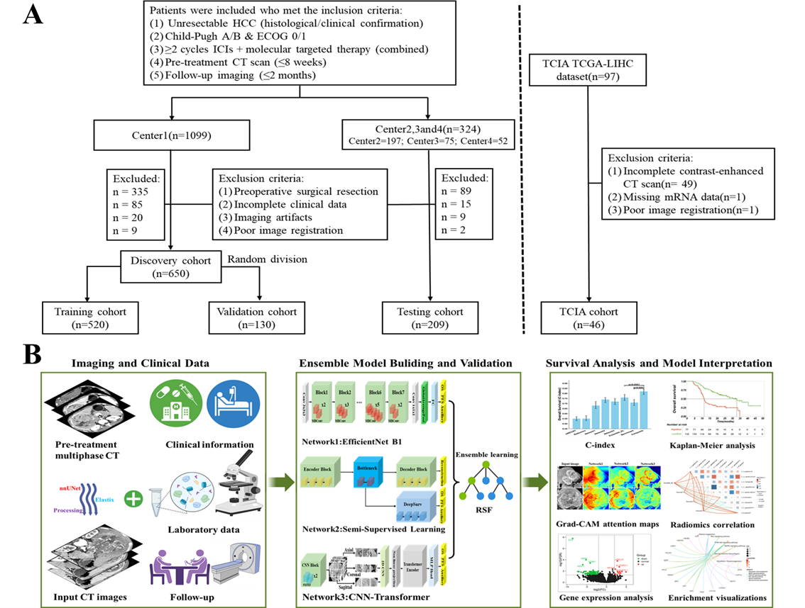
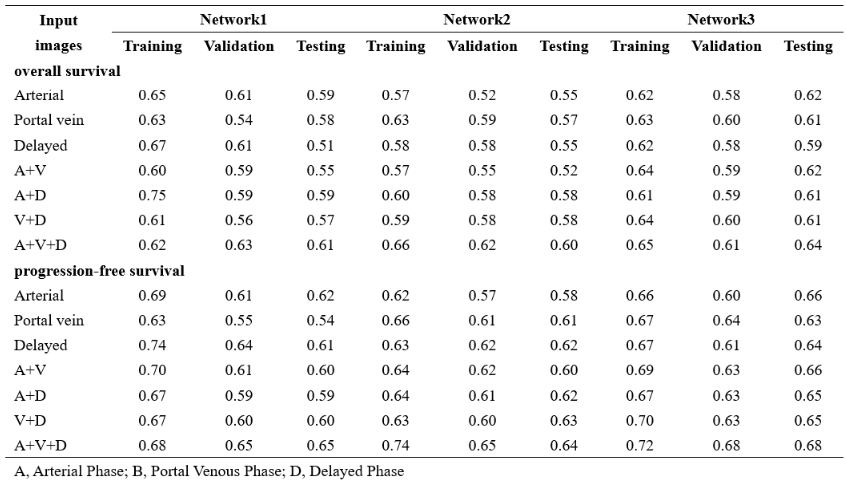
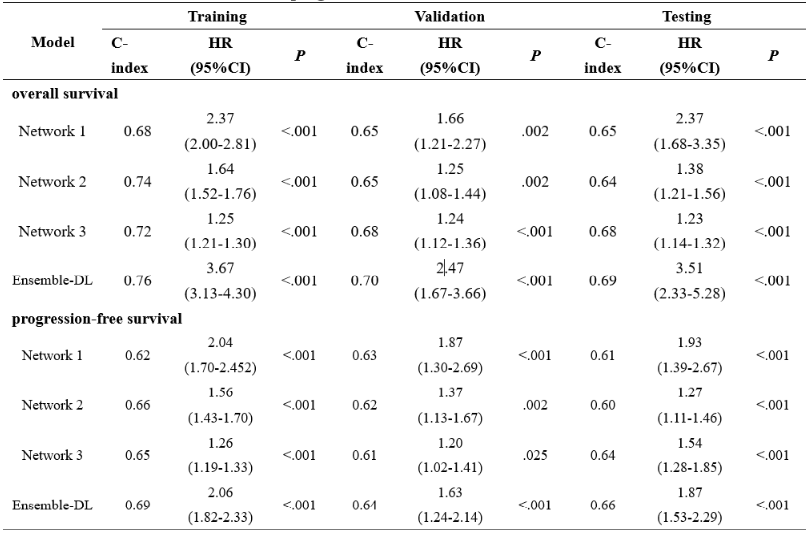
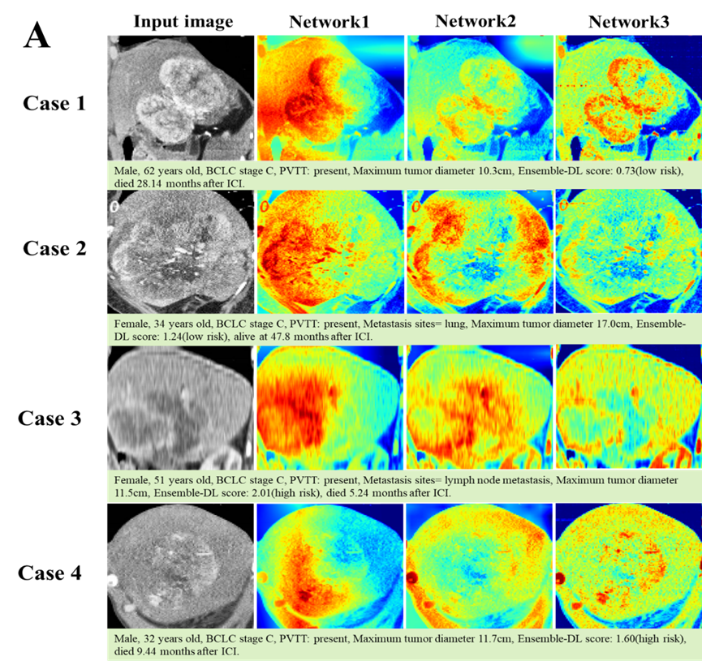

<p align="center">
  <h2 align="center"> CT-Based Ensemble Deep Learning for Predicting Survival Benefits of Immune Checkpoint Inhibitors in Unresectable Hepatocellular Carcinoma: A Multicenter Study</h2>
</p>

## Our article is in the submission stage...

[](LICENSE)

## Overview

We developed an Ensemble-DL model using pre-treatment multiphase CT images to predict overall survival (OS) and progression-free survival (PFS). Three additional machine learning models were built for comparison based on radiomic features, tumor size-based criteria, and established clinical risk factors. We assessed the Ensemble-DL signature's incremental predictive value compared to clinical risk factors and evaluated the model's interpretability.
<br></br>


## Table of Contents

- [Installation](#installation)
- [Dataset](#dataset)
- [Model](#model)
- [Results](#results)
- [License](#license)

## Installation

Please follow the guide to install and set up the project.

```bash
# Clone the repository
git clone https://github.com/wtf633/Whole-liver-DeepL-Model.git

# Create conda environment
conda env create -f environment.yml
conda activate your_environment_name
```
## Dataset

The data that support the findings of this study are available from the corresponding authors with a signed data access agreement. De-identified patient-level clinical and outcome data will be provided upon reasonable request. The CT image data, however, are not available because they contain sensitive information that could compromise patient privacy.

## Model


* **Network 1 (EfficientNet B1 Model):** This subnetwork uses the EfficientNet B1 convolutional neural network (CNN) for supervised learning (Figure A).<br>
* **Network 2 (Hybrid Supervised-Unsupervised Model):** This subnetwork employs a two-stage approach (Figure B).<br>
* **Network 3 (CNN-Transformer Model):** This subnetwork adopts a CNN-Transformer architecture based on multi-plane and multi-slice Transformer networks (Figure C).

## Results

#### Ablation analysis to optimize Network 1 to Network 3in overall survival and progression-free survival



#### Performance comparison between standalone imaging models (Network 1 to Network 3) and Ensemble DL in overall survival and progression-free survival


#### Grad-CAM Attention: Heatmaps show image regions influential for sub-model predictions. Each sub-network emphasizes distinct aspects despite tumor focus


*It is worth noting that the two tables above are only part of our results. Please refer to the full text and supplementary materials for other results.

## License
This project is licensed under the MIT License
